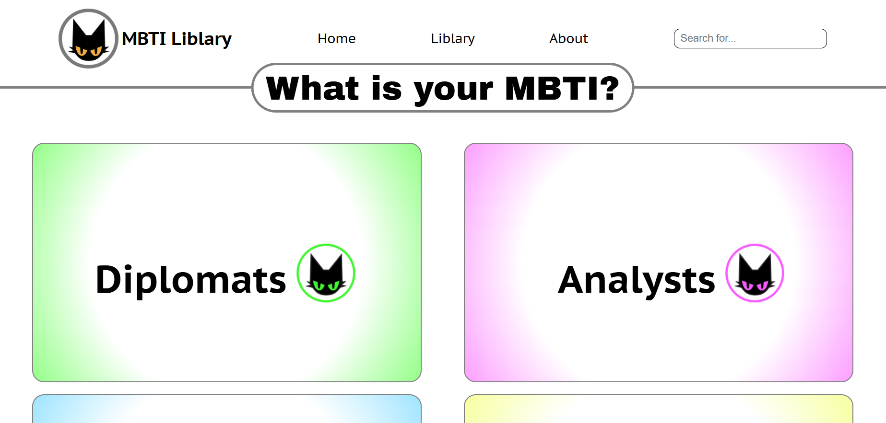

# 16 Personalities Landing — SCSS & BEM Practice

Учебный проект по вёрстке лендинга с использованием SCSS и методологии БЭМ.
Разработан на 3 курсе колледжа в рамках дисциплины HTML/CSS.

## О проекте

Проект представляет собой лендинг-страницу, сверстанную с использованием препроцессора SCSS и методологии БЭМ.

Основной акцент сделан на правильной организации CSS-кода, масштабируемости стилей и соблюдении структуры именования классов.

## Демо

https://kirikiri2.github.io/16-Personality/



## Задача проекта
 - изучить SCSS
 - освоить методологию БЭМ
 - структурировать стили и проект
 - улучшить читаемость и поддержку CSS-кода
---

## Функционал
 - структурированные и переиспользуемые стили
 - использование SCSS (переменные, вложенность, миксины)
 - применение БЭМ для именования классов
 - разделение стилей по модулям
 - 
## Технологии
 - HTML5
 - CSS3
 - SCSS 
 - БЭМ
---

## Роль в проекте

**Выполненные задачи:**

 - верстка лендинга
 - организация структуры SCSS-файлов
 - применение БЭМ-подхода
 - разработка модульной системы стилей
 - оптимизация и упрощение поддержки стилей

## Что решает проект

Проект направлен на улучшение качества frontend-кода:

 - структурирование CSS
 - снижение дублирования стилей
 - повышение масштабируемости проекта
 - подготовка к работе с большими проектами

## Практикуемые навыки
 - работа с SCSS
 - организация CSS-архитектуры
 - применение БЭМ

## Структура проекта
```
16-Personality/
├── index.html
├── бэм/
│   ├── index.html
│   └── style.css
├── img/
│   ├── icon/
│   └── picture/
├── style/
│   ├── main.scss
│   ├── rout.scss
│   ├── main.css
│   └── main.css.map
```

## Запуск проекта
**Клонировать репозиторий:**
```
git clone https://github.com/Kirikiri2/16-Personality.git
cd 16-Personality
```
**Открыть файл:**
```
index.html
```
При необходимости можно редактировать SCSS и пересобирать CSS через любой Sass-компилятор.

---

## Итог

Проект помог углубить знания в верстке и работе со стилями:

 - освоение SCSS как инструмента масштабирования CSS
 - понимание БЭМ как архитектурного подхода
 - подготовка к работе с реальными frontend-проектами
